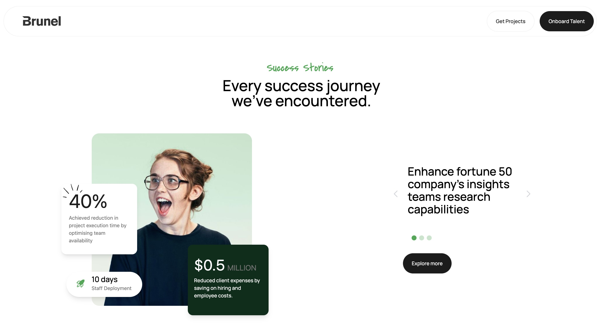
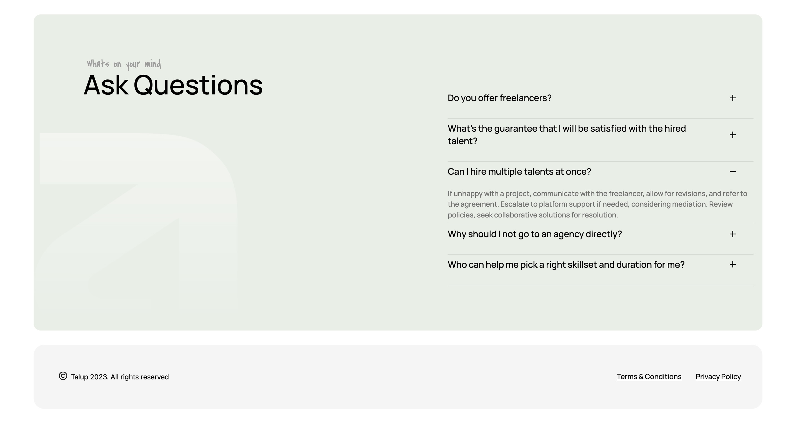
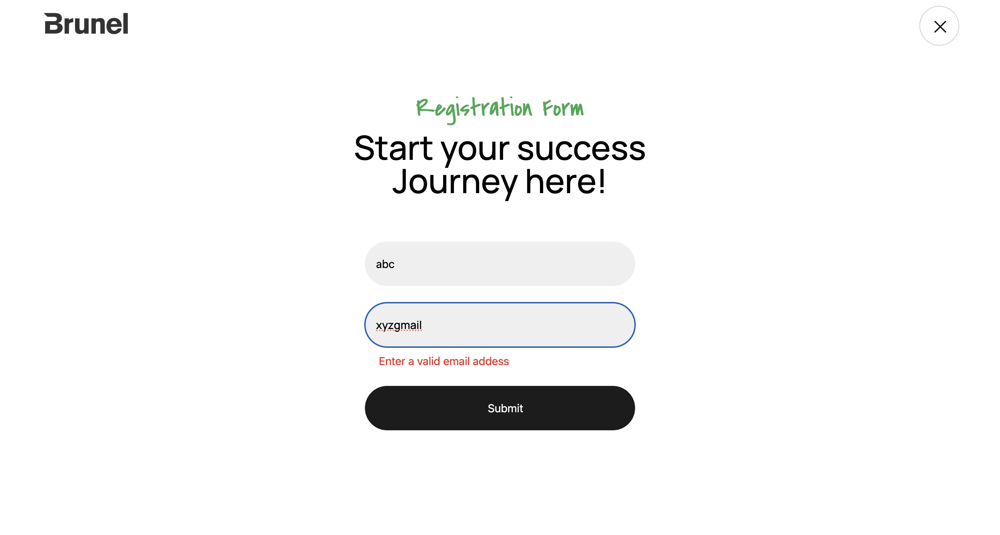
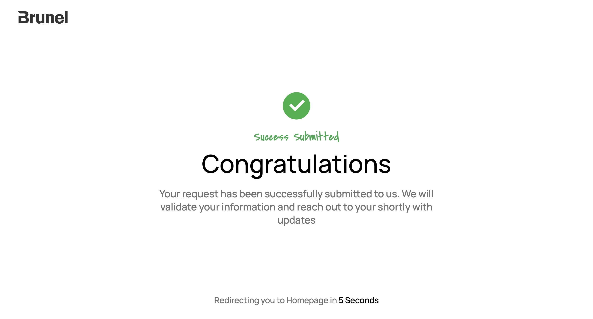

# About Application

Tech Stack used :
React Js
TailwindCss

# run in development

1. copy the git hub repo link.
2. open vs code, navigate to folder type npm i
3. npm run dev

# Features

1. React rounting using react-router dom library.
   routes - /, /home, /registration, /success.

2. Zod validation of form.
3. Responsive design ( mobiles & large screen).

# Project snapshot

## LandingPage

1. Click on Get Project to go to registeration section.

2. Click on question in accordion, displays the answer if present.

## RegisterationPage

1. Check for email validation.
2. Upon submission redirects to success page

## SuccessPage

Confirms the Submission

